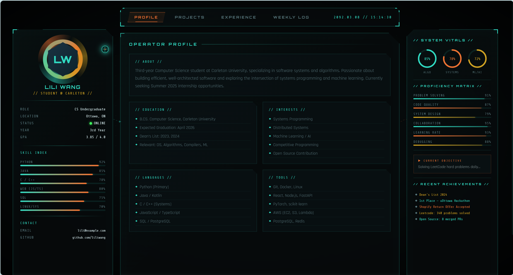

# Sci-Fi HUD Portfolio — Vibe Coded with Claude Code

> **This entire website was generated in a single prompt using [Claude Code](https://claude.ai/claude-code) — zero manual coding.**

---

## Demo

---

## What is Vibe Coding?

**Vibe coding** is the practice of describing what you want in plain language and letting an AI coding assistant generate the implementation for you. No line-by-line coding — just intent, taste, and iteration.

This project was built entirely through a single natural-language prompt given to **Claude Code** (Anthropic's official CLI for Claude). The output is a fully functional, animated, single-file HTML/CSS/JS portfolio with zero frameworks and zero manual edits.

---

## Built With

| Tool | Role |
|---|---|
| [Claude Code](https://claude.ai/claude-code) | AI coding assistant — generated 100% of the code |
| Pure HTML / CSS / JS | No frameworks, no build tools |
| Google Fonts | Orbitron, Share Tech Mono, Rajdhani |

---

## The Prompt

The following prompt was given to Claude Code verbatim to produce this site:

---

> Build a single-page sci-fi HUD-style personal portfolio website in HTML/CSS/JS.
>
> **OVERALL AESTHETIC:**
> Dark background (#060a0b). Accent colors: orange (#f07030), cyan (#30d8c0),
> gold (#d0a020). Fonts: 'Orbitron' for headings, 'Share Tech Mono' for data/labels,
> 'Rajdhani' for body text. Add scanline overlay, dot-grid background, and
> vignette effect. Custom cursor (crosshair style with glowing ring).
>
> **LAYOUT** — absolute positioned irregular panels with clip-path shapes
> (diagonal cuts, notched corners). No standard CSS grid for the main layout.
> Canvas is 1400px wide. Panels have glowing borders, corner accent lines,
> and SVG wire connectors between them.
>
> **SECTIONS** (each as its own irregular HUD panel):
>
> 1. **IDENTITY PANEL** (left column, tall):
>    - Hexagon avatar with rotating conic-gradient ring + scanline animation
>    - Name: [Lili Wang] | Callsign: [Student @ Carleton]
>    - Role, location, status (with blinking green dot)
>    - Info rows: skills level bars (animated on load)
>
> 2. **NAVIGATION** (top center bar):
>    - Horizontal tab buttons: PROFILE / PROJECTS / EXPERIENCE / WEEKLY LOG
>    - Active tab glows orange, inactive dims
>    - Clicking switches the main content panel (JS tab switching)
>
> 3. **MAIN CONTENT PANEL** (center, large, switches on nav click):
>
>    *[PROJECTS VIEW]:*
>    - Grid of project cards, each with clip-path border, project name,
>      tech stack tags, description, status badge (ACTIVE/ARCHIVED/WIP)
>    - Hover: panel lights up with orange glow, shows "ACCESS >" button
>
>    *[EXPERIENCE VIEW]:*
>    - Vertical timeline, each node is a HUD marker with year + company + role
>    - Connecting line animated (draws downward on view-switch)
>    - Each entry expandable on click to show details
>
>    *[WEEKLY LOG VIEW]:*
>    - List of posts with date stamp in HUD format (2090.06.22)
>    - Each post is a collapsible panel, click to expand full text
>    - Tag labels (DEVLOG / RESEARCH / UPDATE) with color coding
>
> 4. **VITALS / STATS PANEL** (right column):
>    - Animated skill meters (fill animation on load)
>    - Small radar chart or ring progress indicators
>    - "Currently working on" blinking ticker
>
> 5. **SYSTEM LOG STRIP** (bottom):
>    - Auto-scrolling marquee of activity log entries
>    - Format: [timestamp] [TAG] message
>
> **INTERACTIONS:**
> - Tab navigation switches main content with a glitch/flicker transition (CSS animation)
> - Project cards: hover glow + scale, click opens modal overlay with full detail
> - Timeline nodes: click to expand/collapse
> - Weekly log posts: click to expand
> - All transitions use cubic-bezier easing, no generic ease-in-out
> - Page load: staggered panel fade-up animation with delays
>
> **ANIMATIONS:**
> - Hex avatar ring: conic-gradient spin
> - Scanline: repeating-linear-gradient overlay fixed to viewport
> - Skill bars: width animates from 0 on load
> - Log strip: CSS marquee scroll
> - Glitch transition: brief chromatic aberration effect on tab switch
> - Blinking elements: opacity keyframe animation
>
> Make all text content placeholder/example. No frameworks, pure HTML+CSS+JS.

---

## Features

- **Identity Panel** — Hexagon avatar with animated spinning conic-gradient ring, skill index bars, contact info
- **Navigation Bar** — 4-tab HUD nav with active orange glow and glitch transition on switch
- **Profile View** — Education, interests, languages, tools grid
- **Projects View** — 6 project cards with status badges (ACTIVE / WIP / ARCHIVED), hover glow, click-to-modal
- **Experience Timeline** — Animated draw-down connecting line, expandable nodes
- **Weekly Log** — Collapsible devlog posts with DEVLOG / RESEARCH / UPDATE tag color coding
- **Vitals Panel** — Ring progress indicators, proficiency meters, rotating objective ticker
- **System Log Strip** — Auto-scrolling marquee of timestamped activity entries
- **Background FX** — Dot-grid, scanline overlay, vignette, all layered
- **Custom Cursor** — Crosshair with pulsing cyan ring

## Usage

Just open `sci-fi-HUD-style/portfolio.html` in any modern browser. No server, no build step.

---

*Generated with [Claude Code](https://claude.ai/claude-code) — Anthropic's AI coding assistant.*
